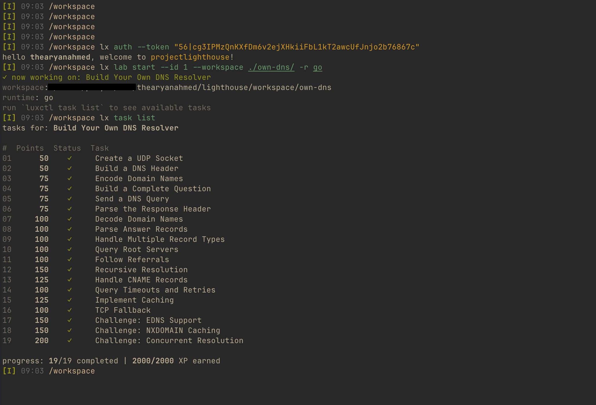

# luxctl

CLI for [projectlighthouse.io](https://projectlighthouse.io) — learn by building real systems.



## Install

### Pre-built Binaries (Recommended)

Download the latest binary for your platform from the [releases page](https://github.com/thearyanahmed/luxctl/releases):


### Via Install Script

```bash
# one-liner (installs Rust if needed)
curl -fsSL https://raw.githubusercontent.com/thearyanahmed/luxctl/master/install.sh | bash
```

### Via Cargo

```bash
# latest version
cargo install luxctl

# specific version
cargo install luxctl --version 0.9.0
```

## Upgrade

```bash
# upgrade to latest
luxctl upgrade

# upgrade to specific version
luxctl upgrade v0.9.2
```

## Quick Start

```bash
# authenticate with your token from projectlighthouse.io
luxctl auth --token $token

# verify setup
luxctl doctor

# see who you are
luxctl whoami
```

## Usage

### Projects

```bash
# list available projects
luxctl project list

# list and open in browser
luxctl project list --web

# show project details
luxctl project show --slug tcp-echo-server

# start a project (by slug or index from list)
luxctl project start --id tcp-echo-server --runtime go
luxctl project start --id 0 --workspace ~/labs

# see progress on the current project
luxctl project status

# change runtime or workspace
luxctl project set --runtime rust
luxctl project set --workspace ~/labs/redis

# stop working on the current project
luxctl project stop

# reset all progress and start fresh
luxctl project restart
```

### Tasks

```bash
# list tasks for the current project
luxctl task list

# force refresh from server
luxctl task list --refresh

# show task details
luxctl task show --task 1

# show full description
luxctl task show --task 1 --detailed
```

### Running Validations

```bash
# run a single task
luxctl run --task 1

# run with verbose per-expectation output
luxctl run --task 1 --detailed

# run against a specific project (overrides active project)
luxctl run --task 1 --project tcp-echo-server

# validate all tasks at once
luxctl validate

# validate all with verbose output
luxctl validate --detailed

# validate across all started projects
luxctl validate --all
```

### Submitting Results

```bash
# submit answers for blueprint tasks that require user input
luxctl result --task 1 --input key=value --input another=value
```

### Hints

```bash
# list available hints for a task (may cost XP)
luxctl hint list --task 1

# reveal a specific hint
luxctl hint unlock --task 1 --hint $hint_uuid
```

### Terminal Challenges

Single-file DSA challenges (LRU Cache, Group Anagrams, etc.).

```bash
# list available terminal challenges
luxctl terminal list

# start a terminal challenge
luxctl terminal start --slug lru-cache --workspace ~/challenges

# run validation against your solution
luxctl terminal run
luxctl terminal run --detailed

# see active terminal info
luxctl terminal status

# clear the active terminal
luxctl terminal stop
```

### Helpers

```bash
# run project-specific data generators (e.g., 1 Billion Row Challenge)
luxctl helper 1brc --rows 1000000 --measurements data/measurements.txt --expected expected/output.txt
```

### Export

```bash
# parse a .bp file and print transpiled IR as JSON (offline, no auth needed)
luxctl export spec.bp
luxctl export spec.bp --format json
```

### Diagnostics

```bash
# check environment and diagnose issues
luxctl doctor
```

## Development

```bash
cargo build           # debug build
cargo test            # run tests
cargo fmt             # format
cargo clippy          # lint
```

## Supported Runtimes

- **Go** - detects `go.mod`, builds with `go build .`
- **Rust** - detects `Cargo.toml`, builds with `cargo check`

## Contributing

Contributions are welcome! Here's how to get started:

1. Fork the repository
2. Create a feature branch: `git checkout -b feature/my-feature`
3. Make your changes
4. Run checks: `cargo fmt && cargo clippy && cargo test`
5. Commit with a clear message
6. Push and open a pull request

### Guidelines

- Follow existing code style
- Add tests for new functionality
- Keep commits focused and atomic
- Update documentation as needed

### Reporting Issues

- Check existing issues before creating a new one
- Include luxctl version (`luxctl --version`)
- Include OS and architecture
- Provide steps to reproduce

## Release

Releases are automated via GitHub Actions. To create a new release:

1. Update version in both `Cargo.toml` and `src/lib.rs`
2. Run `cargo build` to update `Cargo.lock`
3. Commit and push to master
4. Wait for Auto Tag workflow to create the version tag
5. Trigger the Release workflow:
   ```bash
   gh workflow run Release --field tag=v0.9.0
   ```

The Release workflow will:
- Run tests
- Verify version matches tag
- Publish to crates.io
- Generate changelog
- Create GitHub release

## License

AGPL-3.0 - See [LICENSE](LICENSE) for details.

This means you can use, modify, and distribute this software, but if you modify it and provide it as a service (even over a network), you must release your source code under the same license.
